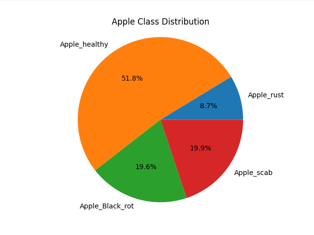
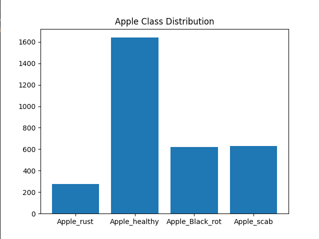
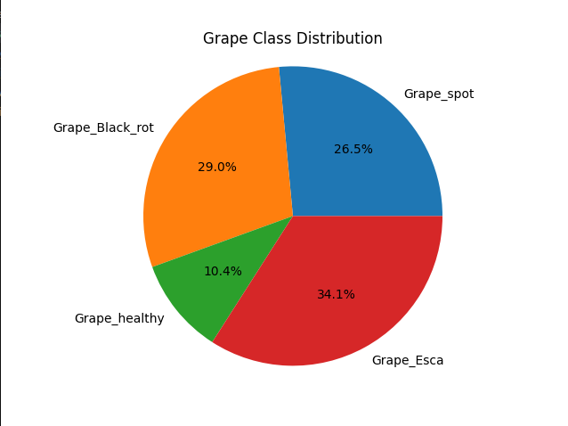
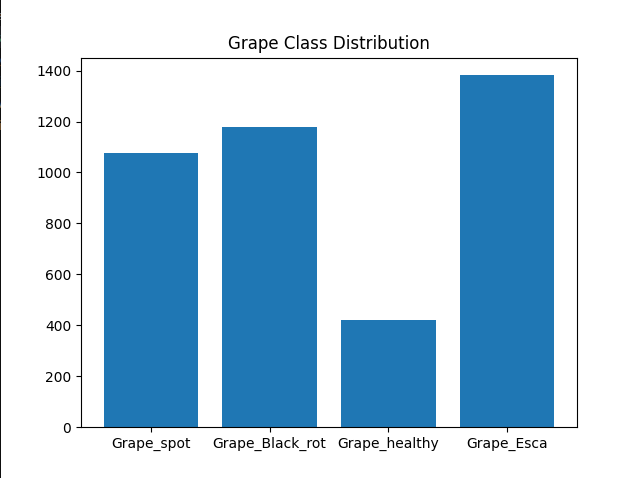

### Part 1: Analysis of the Data Set

The aim with this program, extract and analyze/understand the data set from the images with prompt pie charts and bar charts for each plant type.

We have 2 plant type. Here is the Apple results:

  
  

And Grape:

  
  

After this results we can clearly see the data set is not balanced.