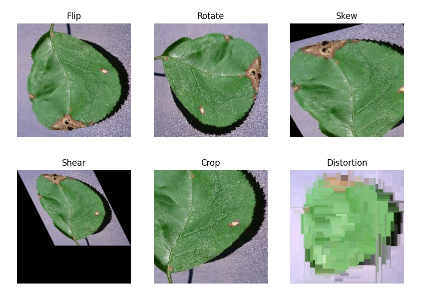
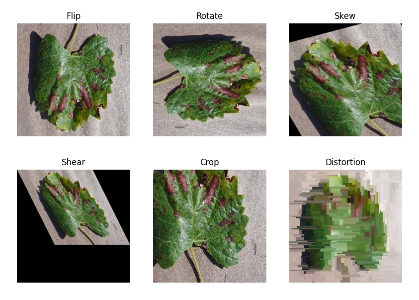
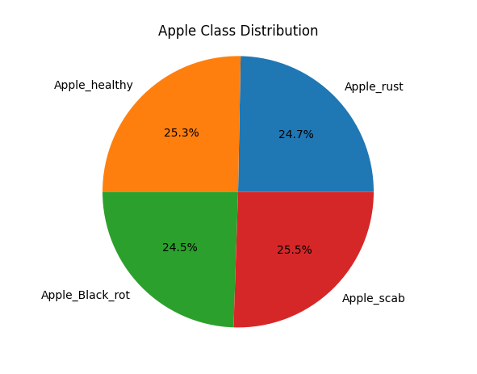
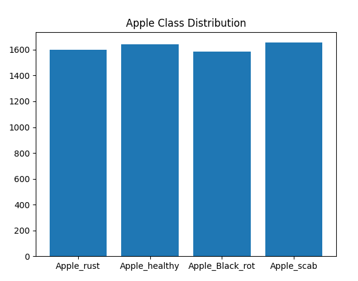
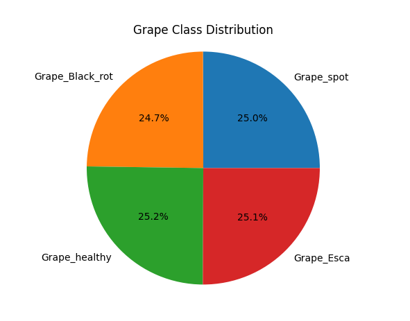
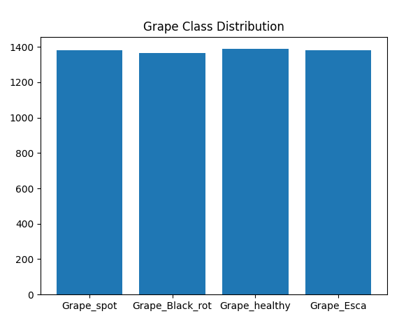

### Part 2: Data Augmentation

To balance data set, we will keep the original image and create new 6 different types of for that image with data augmentation. Our data augmentation techniques are flip, rotate, skew, shear, crop and distortion.

Here is the data augmentation visualization examples for one Apple and one Grape image:

  
  

Instead of process all images one by one in the code side we will do it per two type of leaf (Apple & Grape). Accordingly part 1 results we can see in the Apple database Apple_healthy and in the Grape database Grape_Esca class has the most number of data. So we will process all images except with this classes.

For per class, how much image will processed is determinated by each classes data number. At the end of the data augmentation process we will get the balanced dataset. Here is the result of dataset's after data augmentation for both type.

  
  

  
  

And lastly we are changing our directory name from leaves to augmented_directory for to be able to use in evaluation.