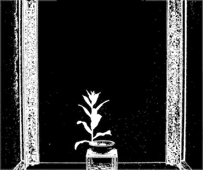
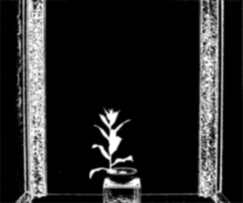
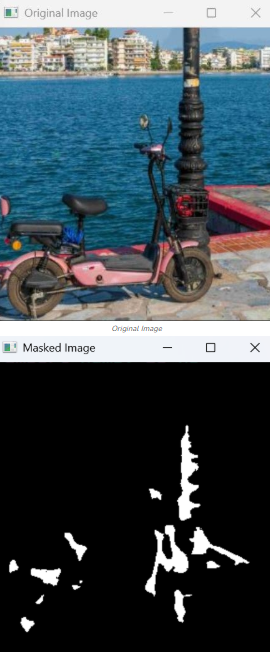
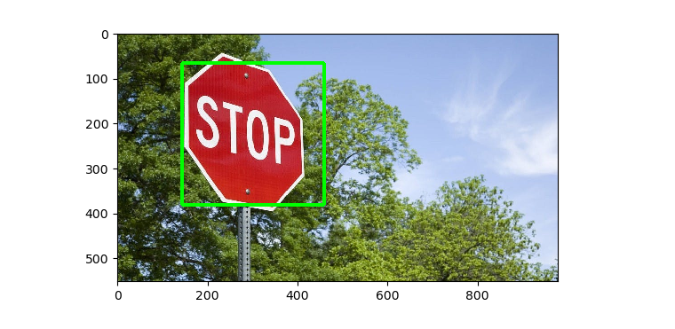
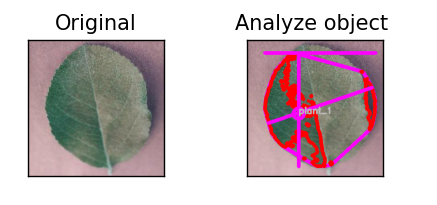
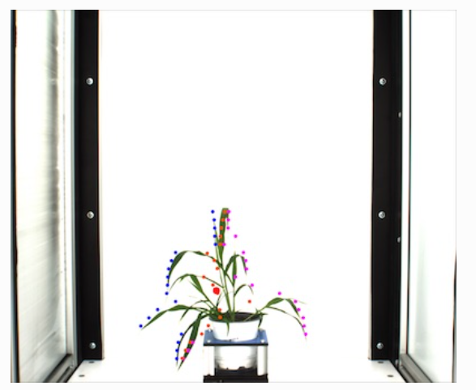

# Part 3: Image Transformation

In this section, six different transformations are applied and visualized to extract direct features from a leaf image:

1. Original
2. Gaussian blur
3. Mask
4. ROI objects
5. Analyze object
6. Pseudolandmarks

## Brief technical explanation

### 1) Original
- What it is: The raw input image.
- What it does: Serves as the reference for all subsequent steps.
- Why we use it: A baseline image is required to compare the impact of transformations.

### Figure IV.1 - Original

### 2) Gaussian Blur
- What it is: A smoothing operation that applies a Gaussian kernel to neighboring pixels (low-pass filtering).
- What it does: Reduces high-frequency noise and stabilizes masking and contour detection.
- Why we use it: With less noise, leaf boundaries and color-based thresholding become more consistent.
- Important note: According to OpenCV documentation, kernel size should be positive and odd (e.g., 5x5).
  
### Figure IV.2 - Gaussian blur

### 3) Mask
- What it is: A binary image where pixels within a selected color range are white and others are black.
- What it does: Separates the leaf from the background.
- Why we use it: Subsequent steps (ROI, shape analysis, landmarks) depend directly on this mask.
- Important note: HSV threshold values are sensitive to lighting and should be adjusted for the target setup.

### Figure IV.3 - Mask

### 4) ROI Objects
- What it is: A bounding-box representation of the region found through mask/contour detection.
- What it does: Clearly highlights the region of interest (leaf area).
- Why we use it: Focuses analysis on the meaningful area instead of the entire frame.
- Important note: In contour-based ROI extraction, the largest contour is not always the correct object; small noisy contours should be filtered.

### Figure IV.4 - Roi objects

### 5) Analyze Object (PlantCV)
- What it is: Uses `pcv.analyze.size` to extract size and shape metrics from the mask.
- What it does: Computes features such as area, perimeter, width, height, convex hull, and solidity.
- Why we use it: Produces a numerical feature set for disease or cultivar analysis.
- Important note: According to PlantCV docs, this function expects a `labeled_mask` and stores measurements under `pcv.outputs`.

### Figure IV.5 - Analyze object

### 6) Pseudolandmarks (PlantCV)
- What it is: Generates pseudo-landmark points by dividing the leaf along axes at equal intervals.
- What it does: Represents leaf form using geometry and point distribution, not only area.
- Why we use it: Captures shape differences more effectively and improves comparisons.
- Important note: `x_axis_pseudolandmarks` returns top, bottom, and center_v points; after scaling, these are useful for size-independent shape comparison.

### Figure IV.6 - Pseudolandmarks

## References

1. OpenCV Smoothing/Filtering: https://docs.opencv.org/4.x/d4/d13/tutorial_py_filtering.html
2. OpenCV Masking: https://www.geeksforgeeks.org/python/masking-in-python-opencv/
3. OpenCV Object Detection (bounding box/detection flow): https://www.geeksforgeeks.org/python/detect-an-object-with-opencv-python/
4. ROI segmentation approach: https://albint.medium.com/image-roi-segmentation-with-opencv-part-2-automating-region-detection-1c74f83624b1
5. PlantCV Analyze Size: https://docs.plantcv.org/en/stable/analyze_size/
6. PlantCV X-axis Pseudolandmarks: https://docs.plantcv.org/en/stable/homology_x_axis_pseudolandmarks/