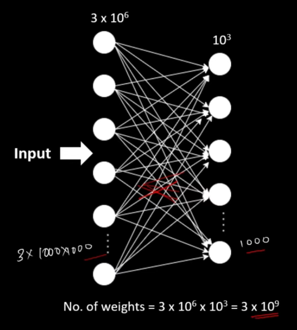
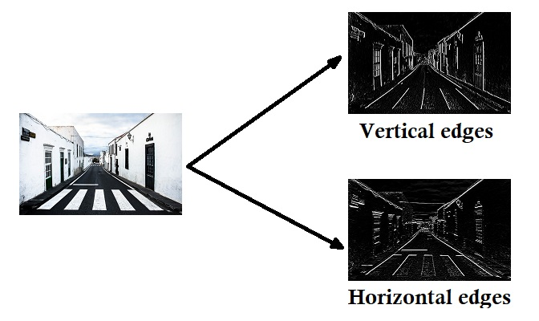
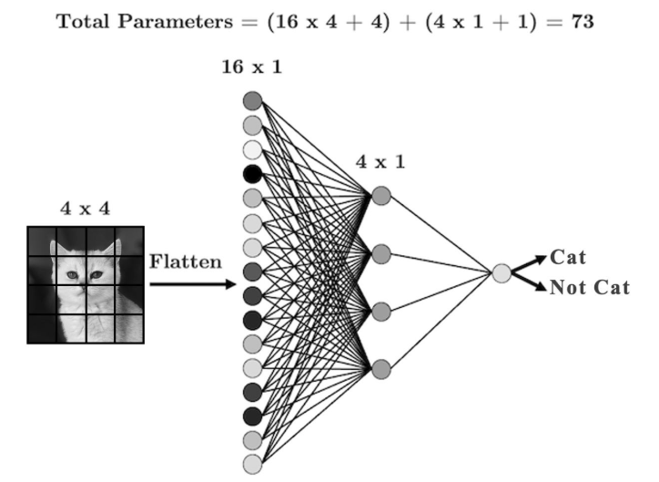
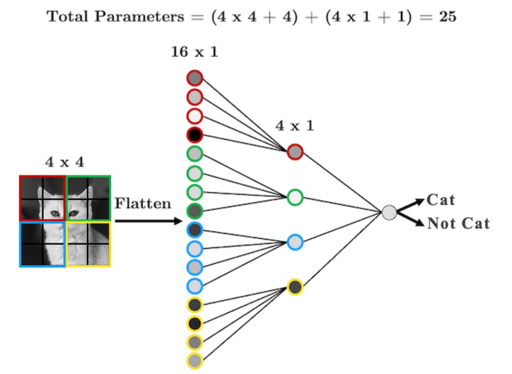
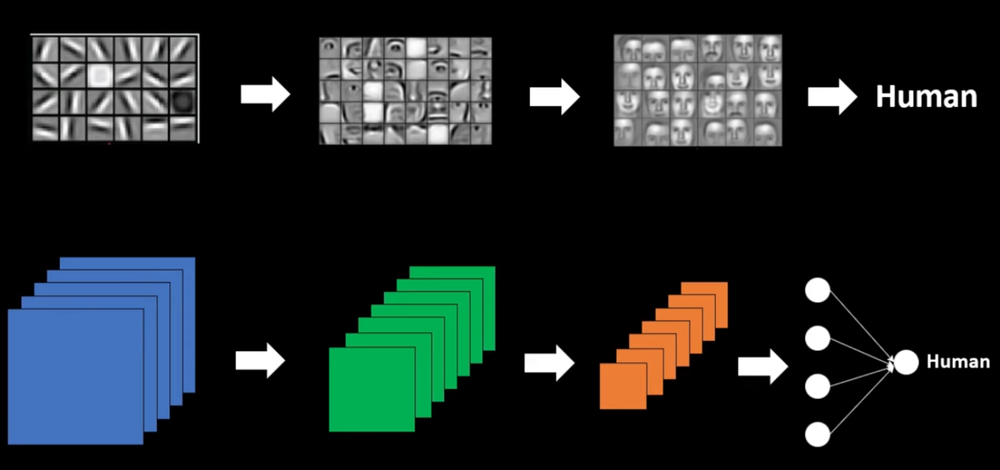

## Convolutional Neural Network Explanantation

### Why we need CNN instead of ANN?

<table align="center">
<tr>
<td width="50%" align="center" style="vertical-align:middle; padding-right:20px; text-align:center;">
Let's say if we have a rgb image dataset having the size of 1000x1000 pixels. Total number of features in this neural network will be 3x1000x1000 which will be equal to 3 million input feautes.
 
 
If our first hidden layer of neural network has only 1000 number of features. Then the total number of connections or the weight parameters between these two layers will be 3x10^6x10^3 = 3x10^9 which will be 3 billion weight parameters.
 
 
And these are the lots of parameters to train. 

</td>
<td width="50%" align="center" style="text-align:center;">

</td>
</tr>
</table>

Thus the number of operations performed will be to large; 
- Our cpu or gpu might not to be able to handle it properly. 
- Even if it handle properly then also time required to train the model will be very high.
- And more number of neurons and more number of weight parameters also means overfitting. It can also affect the performence of our model.

So this is the limitation of the tradional simple neural network while dealing with the images.

### What is CNN?

Convolutional neural network is still neural network but it is a special type of neural network. The main behind idea convolutional neural network is using filters.

<table align="center">
<tr>
<td width="50%" align="center" style="text-align:center;">

</td>

<td width="50%" align="center" style="vertical-align:middle; padding-right:20px; text-align:center;">

These filters are sliding windows in our images that are responsible for detecting the feautres or patterns in the image.

</td>
</tr>
</table>

Image has property that it has edges, shapes, colors and the combination of all these it has features. These filters on cnn will be responsible for detecting these features associated with the image.

<table align="center">
<tr>
<td width="50%" align="center" style="text-align:center;">

</td>

<td width="50%" align="center" style="vertical-align:middle; padding-right:20px; text-align:center;">

We want the computer to understand which objects are in this image. The first thing and the simplest we can do is to detect the vertical and horizontal edges.

</td>
</tr>
</table>

So this two images generated by using a filter only 3x3 pixels. So total number of parameter in this are only 9. We greatly reducing the number of parameters to train.

<table align="center">
<tr>
<td width="50%" align="center">

</td>

<td width="50%" align="center">

</td>
</tr>
</table>

Instead of every input node is connected to every neuron in the next layer; idea is that we might be better off if we have each hidden neuron/node look only at a small area of the image.

	

In a single layer of a convolutional neural network we will be using lot of such filters. And these filters might detect the edges all around the images.

This edges will be passed on the future layers with might detect features associated with the image like eyes, ears, nose etc. Later layers might detect the entire face in the image by combining all the eyes, nose and ears.

Once we identify these features we can associate them to a particular layer. For example feature of the face can be associated with the label human. Thus, next time our model sees a face in a image it will automatically detect the presence of human in it. And cost for this is just a few number of parameters. Thus we have gratly reduced the number of parameters from 3 billion to just a very few.

