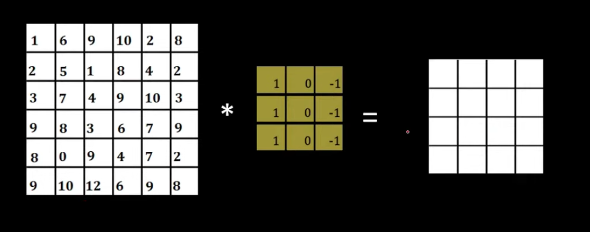
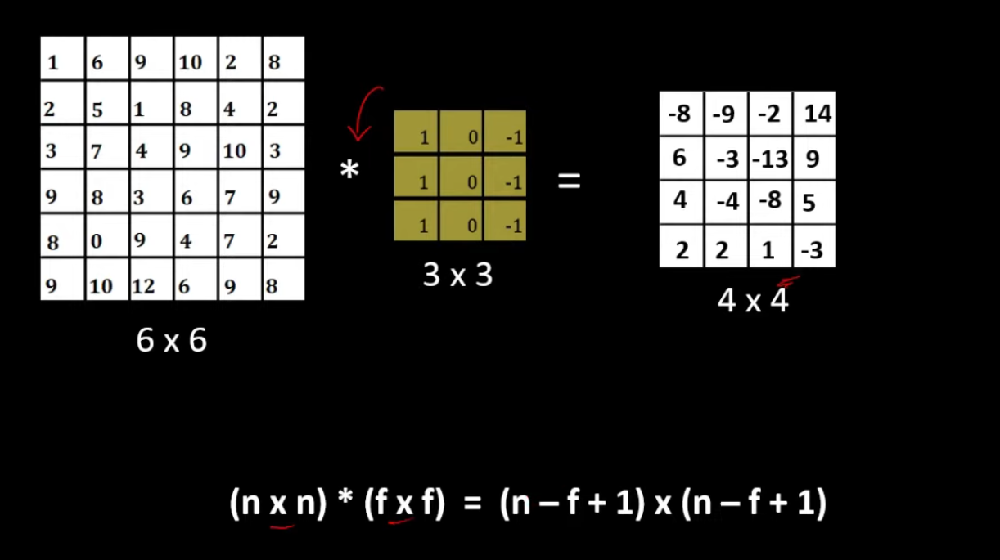
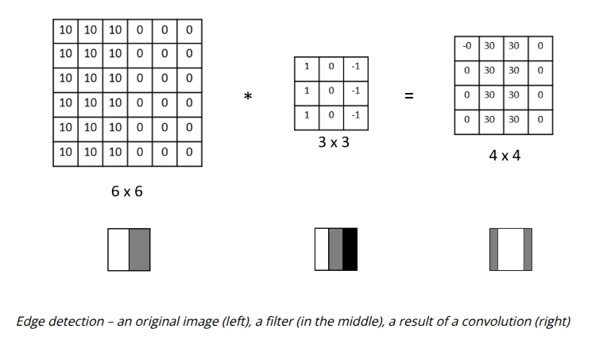
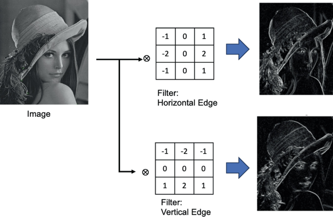
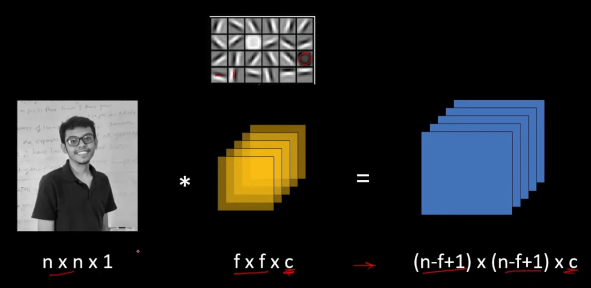
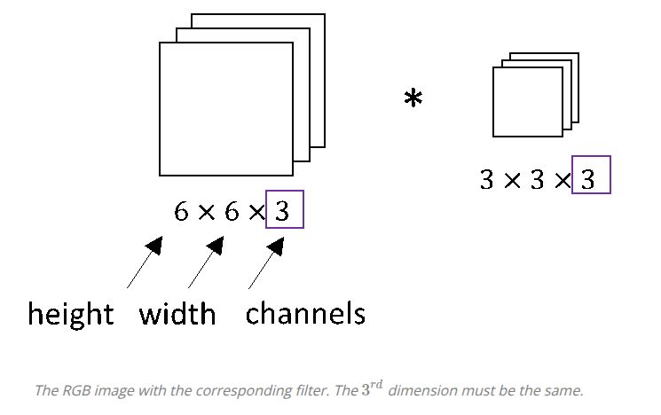
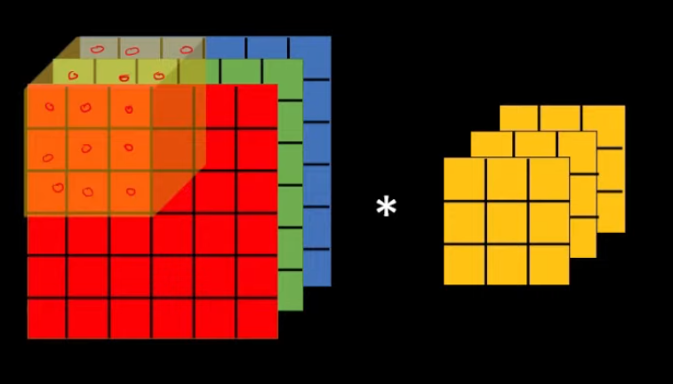
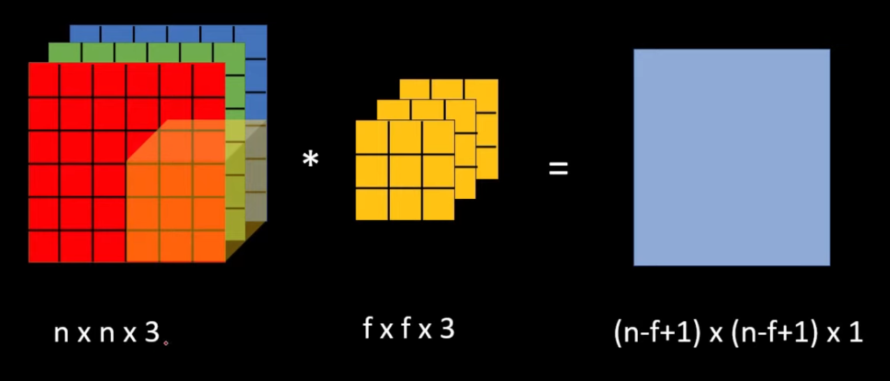
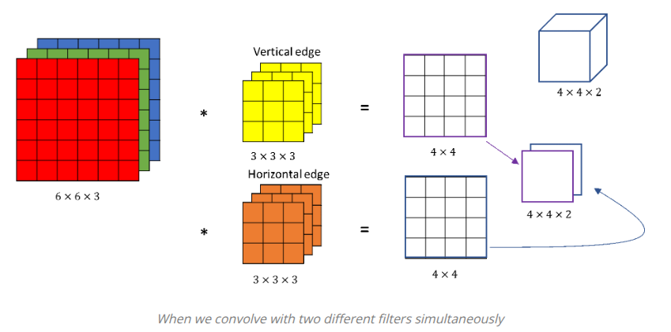
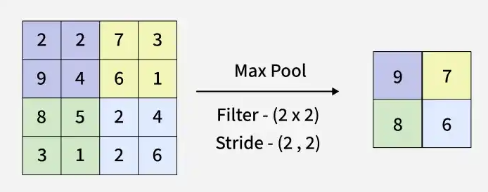

## Convolution Operations in CNN

The main reason for good performance of the convolution neural network is convolution operation. It is responsible for detecting the edges and the features of the images.

### How can we discover the edges in the picture?

Let's say we have a 6×6 pixel image. Since this is a gray image, we will have a 6×6×1 dimension, instead of 6×6×3, because in this case there are no RGB channels. (Numbers represent the pixel value of the image.)

Also we have filter of size 3x3 pixel. And convolution operation between this image and this filter willl generate 4x4 resultant matrix.

	

And the values of this matrix can be obtain by superimposing filter on image and using filter as a sliding window.

	

<table align="center">
<tr>
<td width="60%" align="center">

</td>

<td width="50%" align="center">

We used an image of size 6x6 filter and filter of size 3x3 and resultant matrix is of size 4x4. So any image of size nxn when convolved with the filter of size fxf will generate the output of (n-f+1)x(n-f+1).

</td>
</tr>
</table>

### Edge Detection

<table align="center">
<tr>
<td width="70%" align="center">

</td>

<td width="30%" align="center">

By performing the convolution operation of picture and filter we will get the matrix. This matrix can again be treated as an image after proper rescaling.

</td>
</tr>
</table>

<table align="center">
<tr>
<td width="70%" align="center">

</td>

<td width="30%" align="center">

This is how convolution operation acts as a feature or edge detector in convolutional neural network.
</td>
</tr>
</table>

In a single layer of convolutional neural network we will be using many number of such filters. Different filters will be detecting different features of these images. For example one filter might detect the horizontal edge while one filter might detect the vertical edge while one filter might detect circle feature in our images.

### Convolutions on RGB images?

<table align="center">
<tr>

<td width="30%" align="center">
If we use c number of such filters on grayscale image then the resultant output will have c number of images.

</td>

<td width="70%" align="center">

</td>

</tr>
</table>

<table align="center">
<tr>
<td width="50%" align="center">

<td width="30%" align="center">
Colored image have 3 channel. Size of one colored image will be nxnx3. Performing a convolution operation on a colored image; we will need a filter which also have 3 channel (fxfx3).
</td>

</td>

</tr>
</table>

<table align="center">
<tr>

<td width="30%" align="center">
We will superimpose the filter on image. We will multiply all the values in the individual cell. All these 27 values will be multiplied in every cell. And all this 27 values will be summed up to generate a one resultant output.
</td>

<td width="50%" align="center">

</td>

</tr>
</table>

<table align="center">
<tr>
<td width="70%" align="center">

<td width="30%" align="center">
Single image of size nxnx3 convolve with fxfx3 generates only a single image of (n-f+1)x(n-f+1)x1.
</td>

</td>
</tr>
</table>

<table align="center">
<tr>

<td width="30%" align="center">
We will use many such filters in a single layer of cnn. If we use 3 filters then in the output we will get three different images.
</td>

<td width="70%" align="center">

</td>

</tr>
</table>

### Max Pooling in Convolution Neural Network

Max pooling selects the maximum element from the region of the  feature map  covered by the filter. Thus the output after max-pooling layer would be a feature map containing the most prominent features of the previous feature map.

	

#### Why do we need Max Pooling?

1. Reduce image size, thus reduce computational cost
2. Enhances Features

### Avarage Pooling

Avarage pooling computes the avarage of the elements present in the region  of the feature map covered by the filter. Thus, while max pooling gives the most prominent feature in a particular patch of the feature map, avarage pooling gives the avarage of features present in a patch.

	

