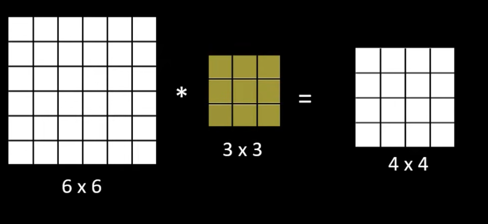
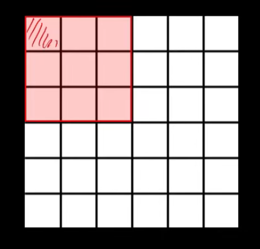
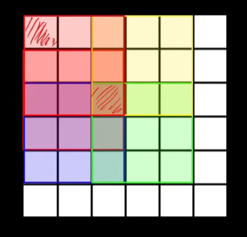
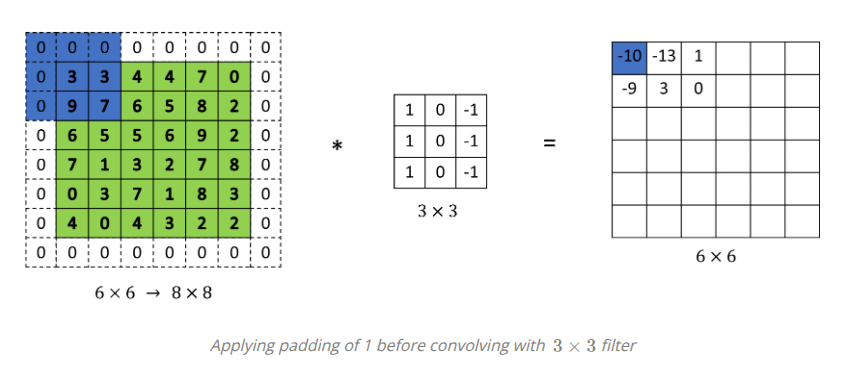
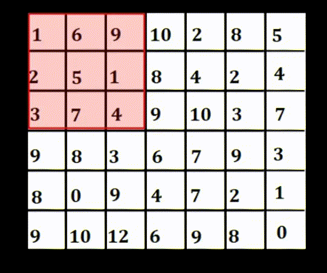

## Padding in Convolutional Neural Network

### Two downsides of convolution:

1. Every time we apply a convolution operator our image shrinks. We've gone from 6x6 down to 4x4, and we can only do this a few times before our image getting really small. Maybe it shrinks down to 1x1. It is possible that the final size of the image get reduced so much that we might lose the valuable information.

	

2. If we look at the pixel at the corner of the image border, that little pixel is touchless, used only in one of the outputs, because it touchless that 3x3 region. But if we take a pixel in the middle, then there are a lot of 3x3 regions that overlap that pixel.

<table align="center">
<tr>

<td width="50%" align="center">

</td>

<td width="50%" align="center">

</td>

</tr>
</table>

To overcome that, we can pad the given image with a border of zeros. And once we apply padding and then perform the convolution operation the final output size is not reduced much. And also corner pixels getting exposed enough number of times.

	

### Valid and Same convolution

<b>The valid convolution</b> this basically means that we don't pad the image. In <b>same convolution</b> when we pad, the output size is the same as the input size.

## Stride in Convolutional Neural Network

<table align="center">
<tr>

<td width="50%" align="center">

If strid is equal to 2, instead of moving by one pixel we can directly move by 2 pixel at once.

</td>

<td width="50%" align="center">

</td>

</tr>
</table>

## Max Pooling in Convolution Neural Network

Max pooling selects the maximum element from the region of the  feature map  covered by the filter. Thus the output after max-pooling layer would be a feature map containing the most prominent features of the previous feature map.

	

#### Why do we need Max Pooling?

1. Reduce image size, thus reduce computational cost
2. Enhances Features

## Avarage Pooling in Convolution Neural Network

Avarage pooling computes the avarage of the elements present in the region  of the feature map covered by the filter. Thus, while max pooling gives the most prominent feature in a particular patch of the feature map, avarage pooling gives the avarage of features present in a patch.

	

