## Convolutional Layer

If we perform convolution operation on image we get values in this image needs to be scaled properly. What we do is, we add a bias and pass it to a [activation (nonlinear) function](https://github.com/eablak/MultilayerPerceptron/blob/main/MLP/model/readme/02_activation_functions.md). Afterwards we will get this image in the output whose size will be same as this image.

	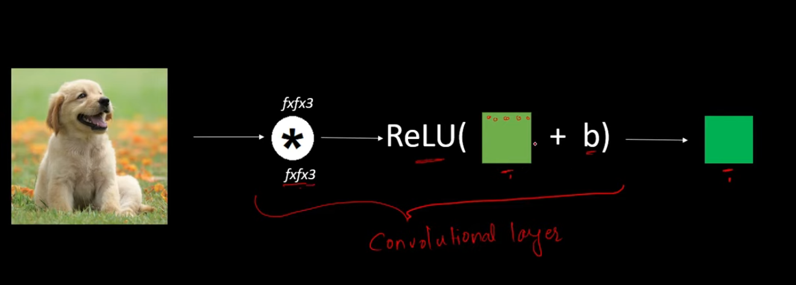

This entire unit which consist of one applying the convolution operation and the other applying the nonlinear activation function is a convulation layer.

If we use multiple filters, then the bias will be changed and we will get multiple outputs.

	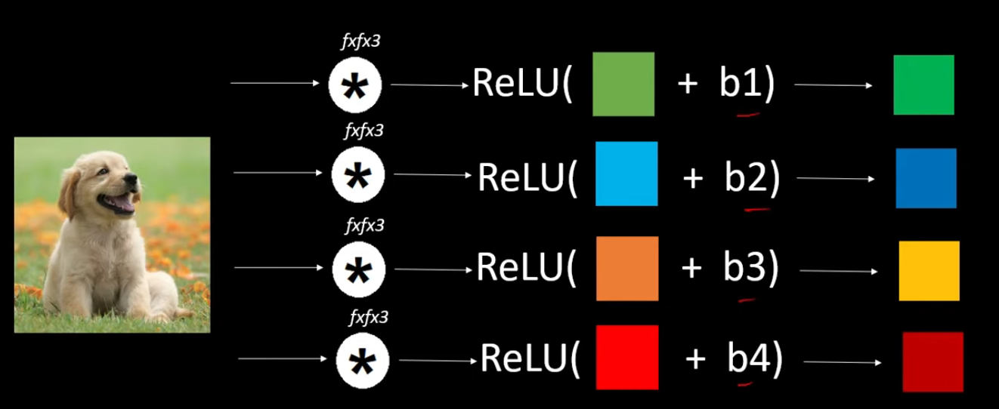

<table align="center">
<tr>

<td width="70%" align="center">

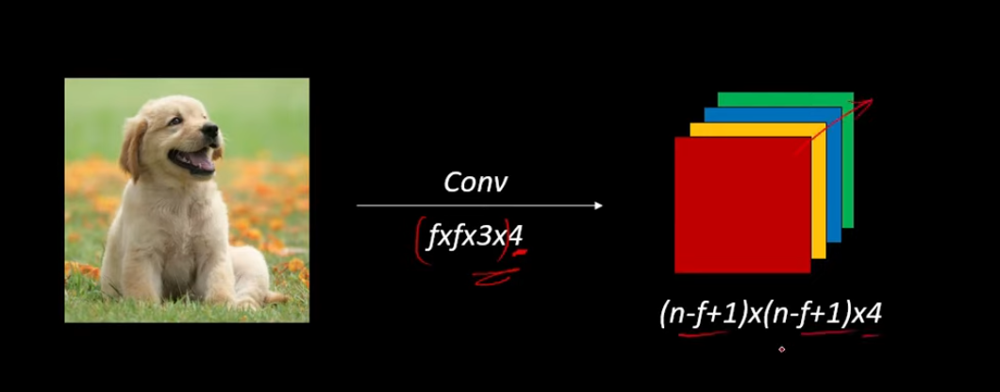

</td>

<td width="50%" align="center">

Here (fxfx3x4) this four means that we are using four filters where the filter size is this we are applying the convolutional layer and we are getting the four channeled output.

</td>

</tr>
</table>

First we will convolve this image with a particular filter size. Let's say the filter size is given by 5x5x3. And we are using a stride of 1 and we are using 4 filters. Thus the output will be 28x28x4 (32-5+1=28, n-f+1). We are using f4 number of filters we will get 4 dimensional output.

After convolving this image we pass it to a max pooling layer. Let's say max pooling with the filter size 2x2 and stride is 2. Thus the dimension will become half. So here 28x28 become 14x14 and number of channels will remain the same.

Traditionally in CNN the combination of both the convolutional layer and the max pooling layer is considered as one layer.

	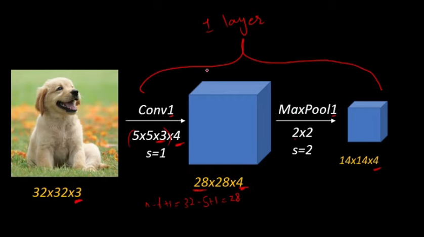

Thus, we can say this is our first convolutional layer.

This output will again be passed to a convolutional layer which will be a conv2 layer. Here we can use any other different filter size.

	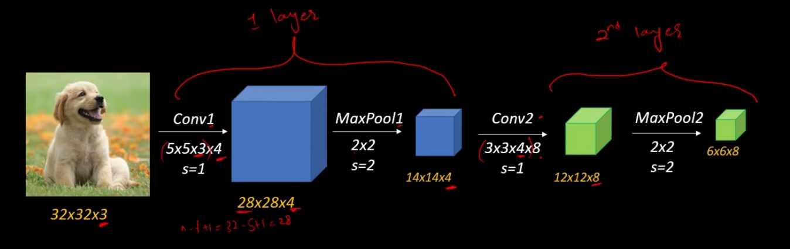

Let's say here we are using 8 filters thus the output here will have 8 channels and again this is passed to the max pooling layer. We will get the output of this size and this layer will be considered as the second layer of our CNN.

Now we can continue repeationg this convolutional layers and max pooling layers as many times as we want. It depends on the type of application. Or we can completely skip this max pooling operation or max pooling layer if we are building a big CNN architecture because the max pooling layer will reduce the size of the image that we are dealing with and we might not want to reduce size too much.

Now once we are done with all the convolutional layers and max pooling layers then it's time to add our fully connected layers. But before we can apply fully connected layers, we need to flatten this final image output.

	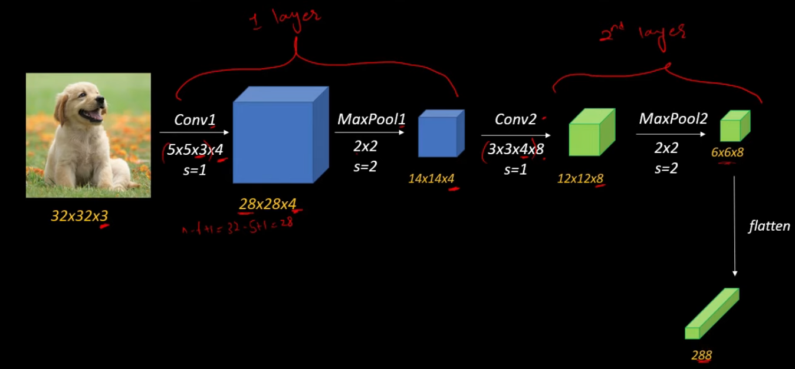

So the 6x6x8 will be flattened into a only one dimensional vector which is 288 units in one vector. We can now connect this with a fully connected layer.

	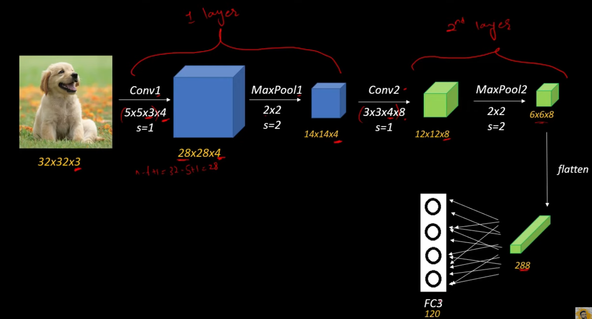

This will be represented by FC3 meaning that this is third layer of our CNN arhitecture. Let's say we have keep the 120 neurons in this layer then these 120 neurons will be connected with every single neurons of this vector. The number of weight parameters here will be 288x120.

We can add multiple fully connected layers here as much as we want. But adding fully connected layer higly increases the amount of parameters that we need to deal with.

In the final layer we are applying the sigmoid or softmax activation function depends on the type of application we are making.

	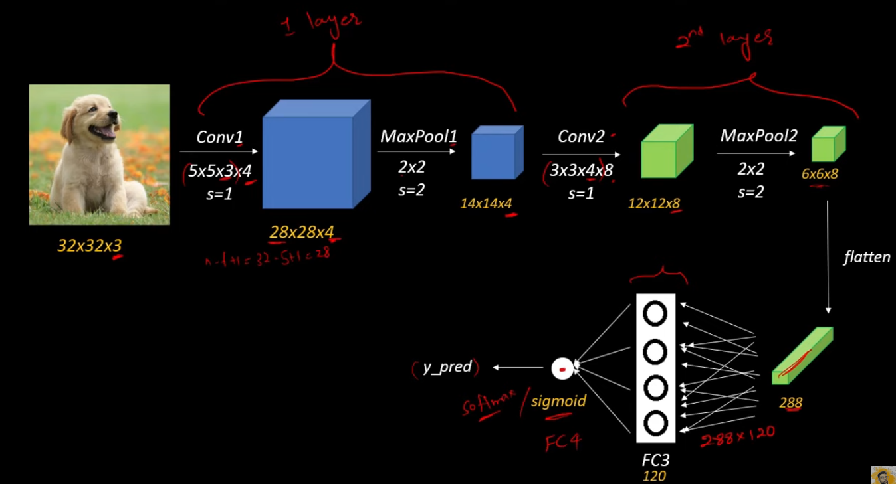

This final layer can be also called as a sigmoid layer or softmax layer or FC4 layer. This final layer will give us our y_pred which is prediction of the category of our image.

To train our model, we use y_pred and use it to calculate the [cost function](https://github.com/eablak/MultilayerPerceptron/blob/main/MLP/model/readme/03_cost_function.md) . This cost function will tell us the amount of error that the model is getting while making predictions.

	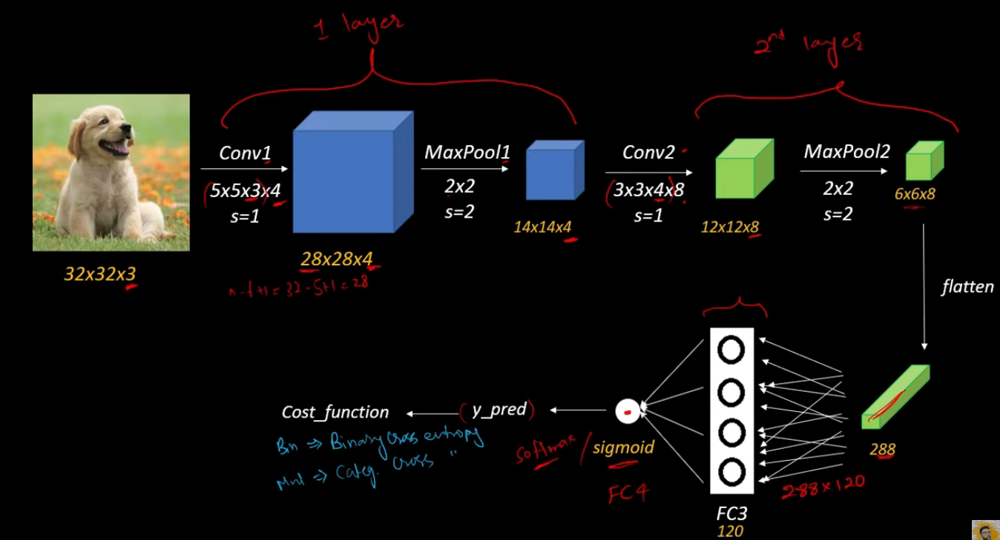

Our job is to minimalize this cost function so that we can train our model and make it more accurate. We are doing this with back propagation algorithm.

	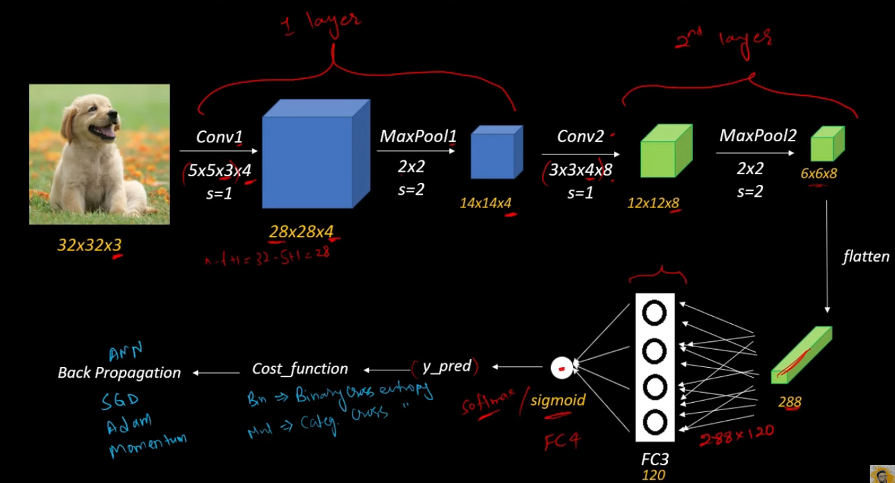

So this is how the compoete architecture of the CNN looks like.

<b>Difference between ANN and CNN:</b>

	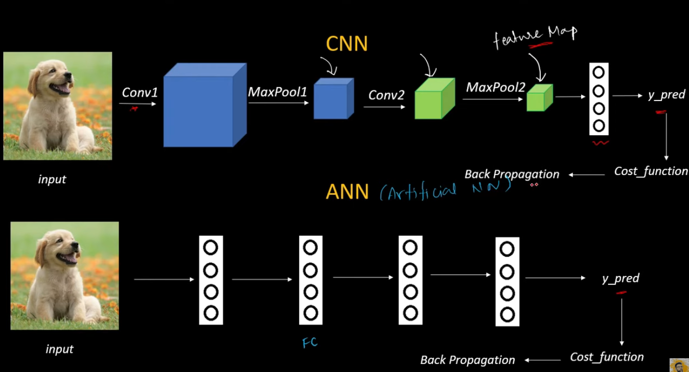

In ANN, we use dense network of these neurons and layers can also be represented with fully connected layers. Thus total number of parameters are extremely high. But we can reduce the number of parameters using these convolution layers and max pooling layers.

<b><i>Note:</i></b>

After learning all CNN architecture if you want to create your CNN model from scratch you can follow [this repo](https://github.com/Coding-Lane/Image-Classification-CNN-Keras/blob/main/Solution%20-%20CNN%20Image%20Classification.ipynb). For leaffliction project, it is trained with combinations of; increased layers count, different activation functions, different dense of neurons and so on.. Because of we need wide model it was taking so much computation power while training and also taking so much time to train everytime. After some trials for training get the above 80 accuracy but it has to be above 90 for this project. So decided to contine with using pretrained model which is <b>EfficientNetB0.</b> You can use this CNN architecture for small model or more flexible threshold values.