# EfficientNet (Image Classification Model)

### How other Convolutional Neural Networks work?

Generally, the believes and works if you want more accuracy in your model or if you want to be your model will be more powerful you have to add number of layers in network. In convolutional neural network if you have more layer in your network (deeper network) it's also call <b>depth scaling.</b> Depth scaling means keep on incresing your number of layers in your network. 

However, when you have lots of layers in a neural network after some potint slowly algorithm may saturation and performance will decrease. So you will face of <b>vanishing gradient problem.</b> To overcome this problem there is <b>ResNet</b> (Resudial Network). ResNet using skip connection concept to overcome this problem.

But now we have lots of layers in a network and because of lots of layers (which is mean lots of processing & lots of computation problem while training) that process will be time consuming when you try to train whole dataset.

### Intuition Behind EfficientNet

<table align="center">
<tr>
<td width="60%" align="center" style="text-align:center;">
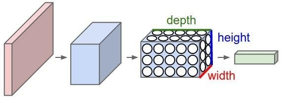

</td>

<td width="50%" align="center" style="vertical-align:middle; padding-right:20px; text-align:center;">

EfficientNet perform on scaling depth, width and resolution.
</td>
</tr>
</table>

Depth means increasing number of layers. Width means increasing number of channels or feature maps. Resolution means image height and weight so incresing number of pixels. The point for here scale all these depth, width and resolution at once in one network.

#### Resolution Scaling

<table align="center">
<tr>
<td width="60%" align="center" style="text-align:center;">
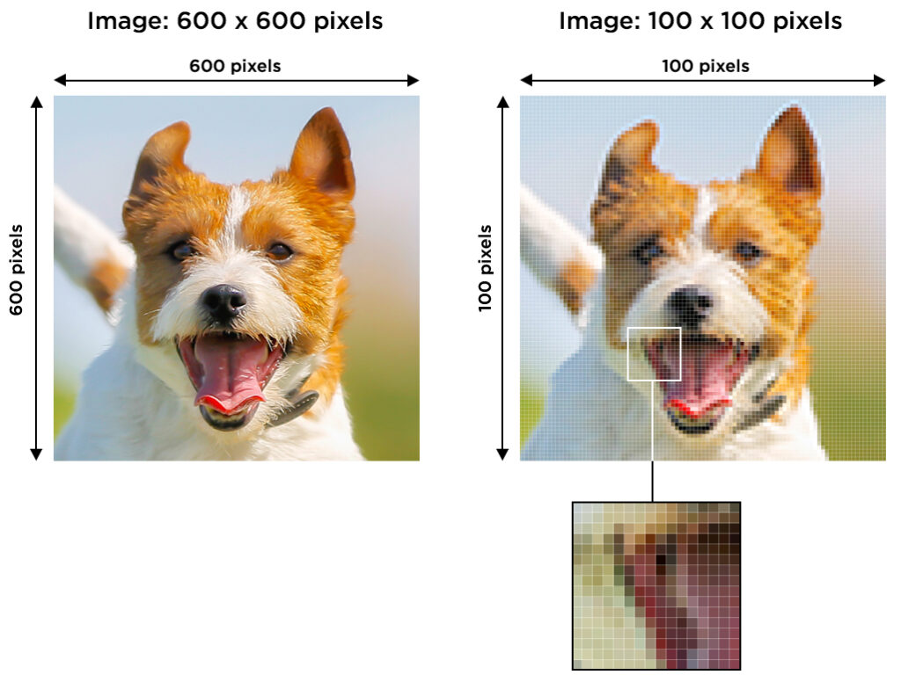

</td>

<td width="50%" align="center" style="vertical-align:middle; padding-right:20px; text-align:center;">

<u>Intuition:</u> If the input image is bigger (resolution), then there is more complex features and fine-gradiend patterns.
</td>
</tr>
</table>

- If you train your algorithm with low resolution image, algorithm will get less detail from picture and learn less information from it. So accuracy will be less.
- If you train your algorithm with high resolution image, which is mean more pixels, more detailled informations then your algorithm will learn more complex features.

#### Depth Scaling

If you are working on high resolution images which is mean you have more data to process. Thus, you need more number of neurons and layers to handle that data. So high resolution need deep neural network.

    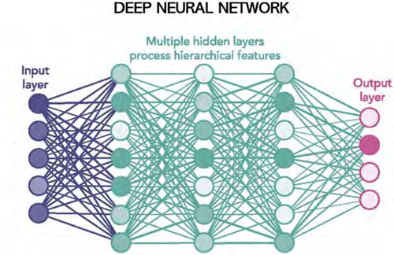

#### Width Scaling

Width scaling means increasing number of channels & feature map. If you are using high resolution image you going to have more number of pixels and to capture that more capture of that pixels, informations you need more feature maps. 

<table align="center">
<tr>
<td width="40%" align="center" style="text-align:center;">

High resolution images use more number of feature maps to get whole details, features.

</td>

<td width="60%" align="center" style="vertical-align:middle; padding-right:20px; text-align:center;">
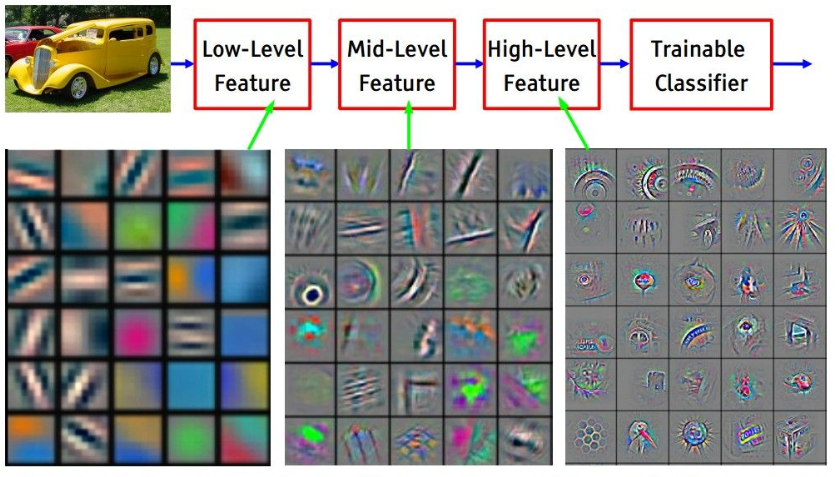

</td>
</tr>
</table>

## EfficientNet: Rethinking Model Scaling for Convolutional Neural Networks

The authors of the [paper](https://arxiv.org/pdf/1905.11946) made the following two observations.

1. Scaling up any dimension of network width, depth or resolution improves accuracy, but accuracy gain diminishes for bigger models.

2. In order to pursue better accuracy and efficiency, it is critial to balance all dimensions of network width, depth and resolution during scaling.

### Baseline Model: EfficientNet 

<table align="center">
<tr>
<td width="50%" align="center" style="text-align:center;">
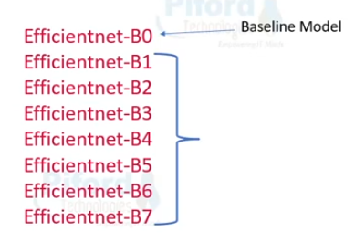

</td>

<td width="50%" align="center" style="vertical-align:middle; padding-right:20px; text-align:center;">

To scale the depth, width and resolution a baseline model is needed, which is called "EfficientNet B0".

EfficientNet are a series of network. It's start from B0 and goes up to B7. Initial network is EfficientNet B0 which is also known as baseline model. 
</td>
</tr>
</table>

<table align="center">
<tr>
<td width="35%" align="center" style="text-align:center;">

Baseline network developed using a neural architecture search (NAS), then scaled up the baseline network to generate a series of models they called "EfficientNet" B1 to B7.

<i>"All numbers are for single-crop, single-model. Our EfficientNets significantly outperform other ConvNets."</i>
</td>

<td width="50%" align="center" style="vertical-align:middle; padding-right:20px; text-align:center;">

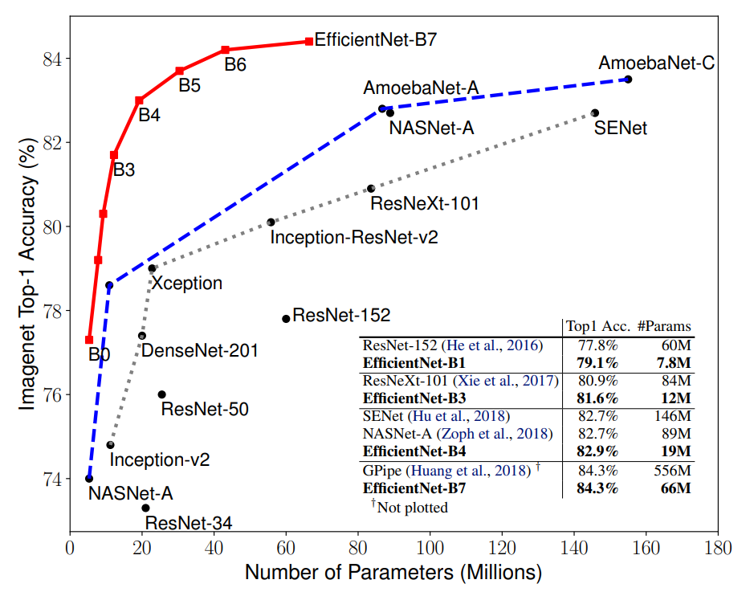

</td>
</tr>
</table>

<b>EfficientNet B0 Architecture:</b>

	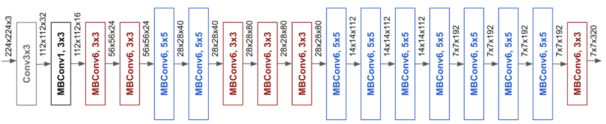

<table align="center">
<tr>
<td width="50%" align="center" style="text-align:center;">

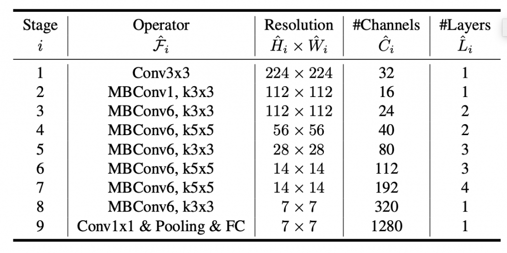
</td>

<td width="50%" align="center" style="vertical-align:middle; padding-right:20px; text-align:center;">

First layer is a convolution layer with a size of 3x3, resolution image is 224x224, number of channels is 32 and number of layers is 1. So these others are number of layers we have in EfficentNet B0 arcihtecture which is developed by NAS.

</td>
</tr>
</table>

Now, on this network will perform <b>compound scaling</b> and we will upscale our EfficientNet model.

### How much depth & width & resolution scaling ?

<table align="center">
<tr>
<td width="50%" align="center" style="text-align:center;">

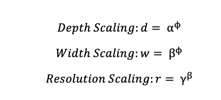
</td>

<td width="50%" align="center" style="vertical-align:middle; padding-right:20px; text-align:center;">

<b>Compound Scaling Method</b> 
 <b>α</b> is d: depth scaling factor <b>β</b> is w: width scaling factor  <b>γ</b> is r: resolution scaling factor  <b>f</b> is network scaling factor

</td>
</tr>
</table>

We are using compound scaling method to know that up to what extent we can scale a network. α, β and γ is already fixed. We have only have to change the value of φ (phi). 

	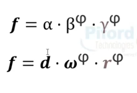

The creators of EfficientNet applied the grid search technique to get α = 1.2, β = 1.1, γ = 1.15, φ = 1. These values means if the resolution of image is increase by 15% then depth of the model should increase by 20% and width of the model should increase by 10%. This is how they have fix these values in balance way.

We are getting phi after performing grid search. When you perform grid search you will get a value of phi. We will apply this value of phi over this equation and we will get the know how much upscaling is required.

#### EfficientNet B0-B7 Architecture

<table align="center">
<tr>
<td width="50%" align="center" style="text-align:center;">

All those B0-B7 networks blocks architecture will be same. Only change would be resolution, channels and layers.
</td>

<td width="50%" align="center" style="vertical-align:middle; padding-right:20px; text-align:center;">

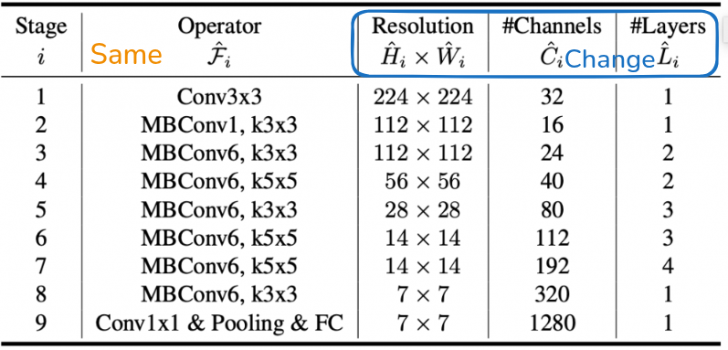

</td>
</tr>
</table>

In every upsacale model we will have more resolution, more channels and more layers. In every upscale model we are having a image of high resolution and for every high resolution image we need more layers to process it, we need mor channels & feature maps to capture the information. Every new EfficentNet model will be a larger the previous model.

<b><i>Note:</i></b> 

If you want to create EfficientNet model from scratch you can follow [this](https://github.com/aladdinpersson/Machine-Learning-Collection/blob/master/ML/Pytorch/CNN_architectures/pytorch_efficientnet.py) repo. In this project its preferd to use pretrained model from Keras library.